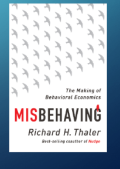
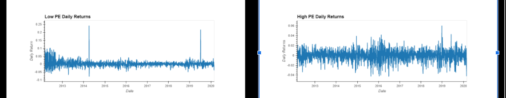
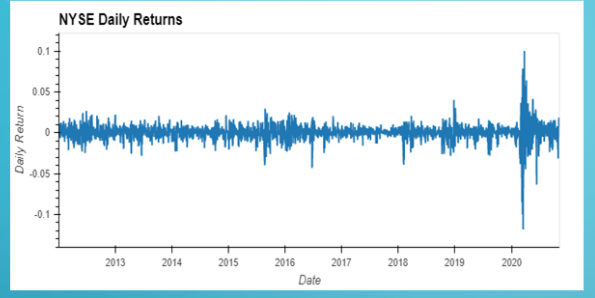
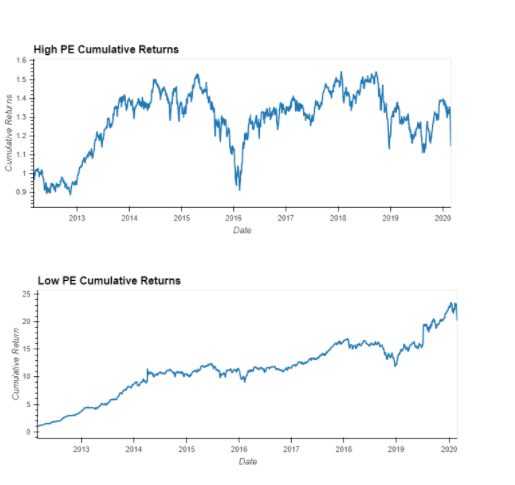
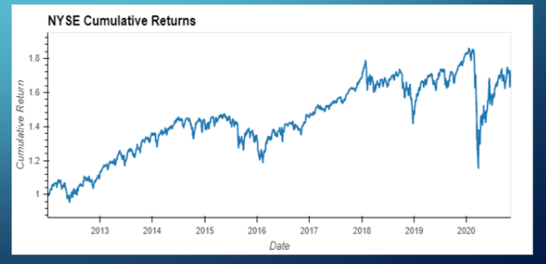
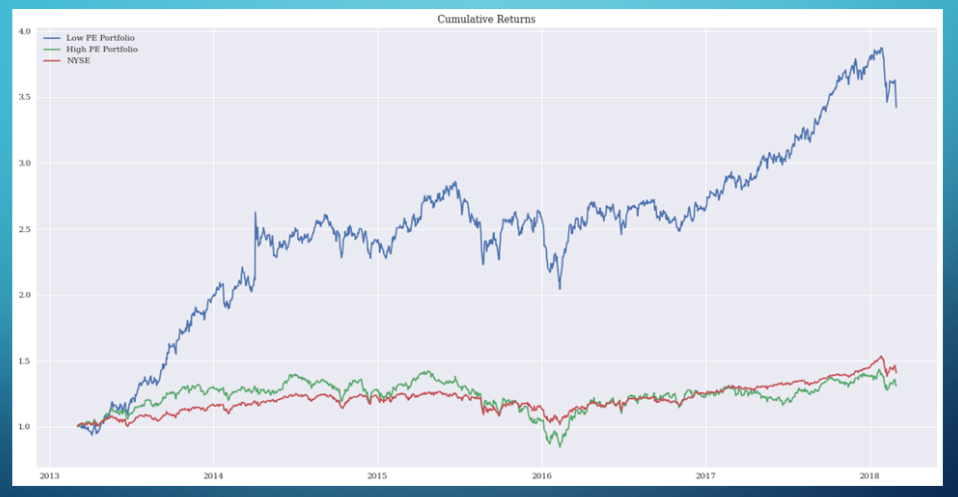

# Hi_Lo_Investing

Contributories: Anna, Dana, Nico 
---
## Background

According to Richard Thaler, over the period from 1937 to 1969, $10,000 investment in the cheap stocks would have increased in value to $66,900, while the expensive stocks portfolio would only increased to $25,300.

Is that still true in current times?

## Data Sets & Method

Our team decided to use NYSE composite data to test the theory.
1. Analyzed approximately 50 stocks that listed IPO in late 2011 to early 2012.
2. Calculated the median Price to Earnings Ratio of all stocks to establish a base-line.
3. Hand-picked 15 stocks each with high and low Price to Earnings ratio.
4. Created two portfolios that will be compared against the NYSE composite index. 

## Tools/Modules Used

1. Monte Carlo Simulation
2. API’s (NYSE)
3. Matplotlib
4. Hv Plot 
5. FFN (Financial Function)
6. Jupyter Lab 

## Daily Returns 

## Cumulative Returns 

## All Cumulative Returns Compared 

# DISCLAIMER

With a $10,000 dollar investment for 15 years our simulations indicate:

NYSE: $7,634-$81,808

High PE: $7,741-$31,830

Low PE Results: $496,489-$21,234,482

In conclusion  our results seem to show that Low PE did better over time against the NYSE; but we also reliazed that the Monte Carlo Simulation Model does not take into factor economic variables that affect price so the results are vastly skewed. With a few modifications we should be able to give a more accurate prediction.

